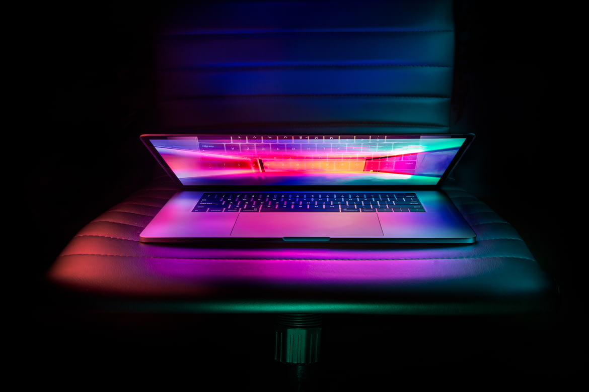

# DisablePanel

### 禁用开发者工具

<br />

在有些项目中，为了保护图片的隐私，会禁止用户把图片下载到本地；
是否是仅仅不能右键保存，还是也不能通过F12打开控制台保存，通过`contextmenu` 、`keydown`这两个参数可以完全控制当前页面。

<br />

<disablePanel></disablePanel>

<br />

如果全部禁用的话，我们发现这个图片就不能保存了；

<br />



<!-- #尽管全部禁用了，但是还有种方法可以下载图片；此时我们把鼠标移动到浏览器右上方的设置那里，找到更多工具中#的开发者工具，从这里也可以打开控制台😂 -->

#### 代码
<br />

```js
<lk-disable-panel :contextmenu="contextmenu" :keydown="keydown"></lk-disable-panel>
```

### Attributes

| 参数     | 说明         | 类型    | 可选值                            | 默认值 |
| :------- | :----------- | :- | :----------------------------------- | :----- |
| contextmenu    | 右键是否禁用         | boolean  | —                      | false      |
| keydown    | F12是否禁用 | boolean | —              | false   |
<style>
table th:first-of-type {
    width: 20%;
}
table th:nth-of-type(2) {
    width: 30%;
}
table th:nth-of-type(3) {
    width: 10%;
}
</style>